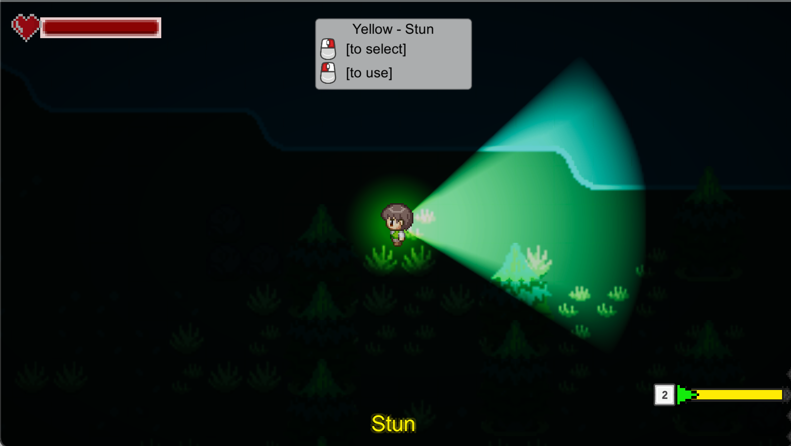

# EECS 494 Portfolio Site
Ninad Chavan

---
## Project 1 - Dungeon and Custom Level for Zelda
 
<a href="/eecs494/zelda.zip">MacOS and Windows Builds</a>

## Project 2 - Tetris Tiles
 
<a href="/eecs494/nchavan-p2-gold.zip">MacOS and Windows Builds</a>

## Project 3 - Midnight Madness
 

<a href="/eecs494/bigfoot-builds.zip">GoldSpike - MacOS and Windows Builds</a>

<a href="/eecs494/midnight-builds.zip">Milestone - MacOS and Windows Builds</a>

<a href="/eecs494/p3-milestone-2.zip">Milestone 2 - MacOS and Windows Builds</a>

<a href="/eecs494/p3-alpha.zip">Alpha - MacOS and Windows Builds</a>

<a href="https://drive.google.com/file/d/1kLvP-W_ruKRzV7La5afvEL7bxk6CAMV_/view?usp=sharing">Beta - MacOS and Windows Builds</a>

<a href="https://drive.google.com/file/d/12YkcKmM6c8BDLHGp1nKYGz7CY2whZBwc/view?usp=sharing">Gold - MacOS and Windows Builds</a>
